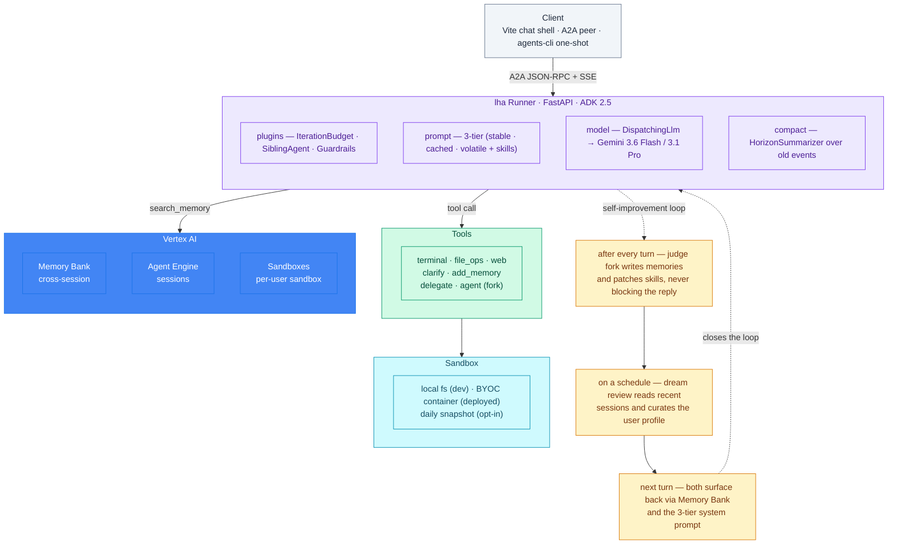
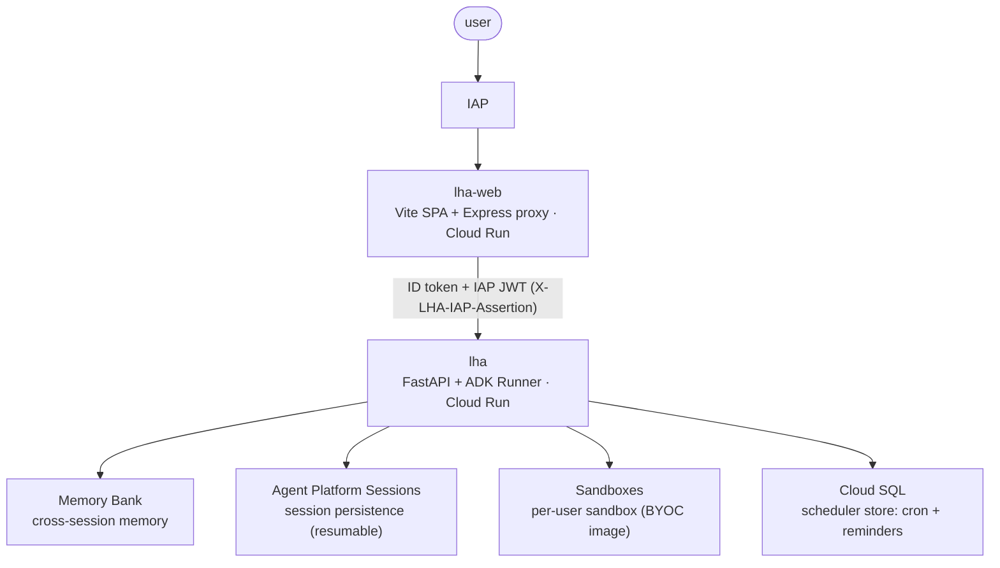

# Architecture overview

This document explains how Long Horizon (the `horizon` package) is put together and where to
look when you want to understand or change a behavior. It is for new maintainers, and for
readers who want a practical map of the system without reading the whole implementation
first.

Horizon is a long-horizon, self-improving agent on Google's Agent Development Kit (ADK 2.x)
and Vertex AI. It acts in the user's Google Cloud and Workspace, runs code in a per-user
sandbox, fires reminders and scheduled chats, uses the user's own secrets without exposing
them to the model, and improves itself between turns by writing facts to memory and
techniques to a skill library — built on managed primitives rather than reinventing the
agent loop, memory store, or session persistence.

## System shape



## In this doc

- [Which layer owns it](#which-layer-owns-it) — the Horizon / ADK / Vertex stack, and how to localize a behavior to one layer.
- [Construction](#construction) — the served app and what `_build_app_object` assembles (model, tools, callback chains, plugins, App).
- [Execution](#execution) — the per-turn flow through the callback chain, tools, and environment interface, plus the deployed request path.
- [Backend tree map — where to start](#backend-tree-map--where-to-start) — per-subsystem start-here files for reading the code.
- [Where custom code earns its keep](#where-custom-code-earns-its-keep) — the interfaces you own vs the ADK/Vertex knobs you only set vs the applications you compose.
- [Troubleshooting](#troubleshooting) — debug-by-symptom: a behavior, where to look, and why.
- [Design tradeoffs](#design-tradeoffs) — what the architecture optimizes for and what it costs.
- [Where to go next](#where-to-go-next) — sibling docs for the next level of detail.

## Which layer owns it

Most questions get easier once you know which layer owns the behavior you are looking at.

```txt
Horizon     custom interfaces: env interface, guardrails, secrets, delegation + HITL, self-improvement, 3-tier prompt
ADK         agent loop: Runner, callbacks, plugins, App, sessions, memory
Vertex AI   managed: Gemini, Memory Bank, Agent Platform Sessions, Sandboxes
```

Starting from the bottom:

- **Vertex AI** is the managed substrate: the models (Gemini), Memory
  Bank (cross-session memory), Agent Platform Sessions (resumable session persistence), and
  Sandboxes (the per-user BYOC sandbox). Horizon configures these; it does not implement them.
- **ADK** is the agent runtime: the `Runner` drives the loop that calls the model, runs
  tools, and repeats; `App` holds the agent plus plugins and compaction/cache/resumability
  config; ordered callback chains and plugins are the hook points; session and memory
  services are pluggable. Horizon does not introduce a new runtime — it uses ADK's.
- **Horizon** is the opinionated harness *on top of* ADK. It assembles the tool set, the
  ordered callback chains, the plugins, and the `App`, and adds the [custom
  interfaces](#where-custom-code-earns-its-keep) most long-running agents need.

To localize a behavior: if it is about how the model is invoked, what state carries between
steps, or how a turn is persisted/resumed, it is **ADK** — read `horizon/agent.py`'s wiring,
then ADK. If it is a managed capability (a model, memory, a sandbox, a quota/region error),
it is **Vertex** — region and enablement, not Horizon code. Everything else — prompt
assembly, guardrails, secrets, the env interface, delegation, self-improvement — is **Horizon**
and lives in this repo.

## Construction

The agent is defined in **`horizon/agent.py`** — `root_agent` + the ADK `App`, with the
full tool/callback/plugin wiring, built once as the module-level `app` / `root_agent`
singletons. **`horizon/fast_api_app.py`** serves it: it resolves the session/memory/
artifact backends and the sandbox from the environment, builds the ADK `Runner`, and
mounts the routes.

```bash
uvicorn horizon.fast_api_app:app --port 8001   # the served app
```

```python
from horizon.fast_api_app import build_runner

runner = build_runner()  # embed without FastAPI (CLI/batch); services from env
```

- **`horizon.fast_api_app:app`** — the FastAPI surface (A2A + `/lha/*` + `/scheduler/*`),
  built lazily via module `__getattr__` so a bare `import horizon` stays offline. Every
  router mounts; ship a subset by deleting `attach_*` calls (see
  [`docs/security-model.md`](security-model.md)).
- **`build_runner()`** — resolves services (session/memory/artifact) + the sandbox and
  returns a plain ADK `Runner` for embedding without the HTTP surface.
- **Config is by environment** — `LHA_ROOT_MODEL`, `LHA_ENVIRONMENT_BACKEND`, service
  URIs (`SESSION_DB_URL`, `AGENT_ENGINE_RESOURCE_NAME`, `LOGS_BUCKET_NAME`). A custom
  sandbox backend installs via `set_environment_provider(factory)`; anything deeper is a
  `horizon/agent.py` edit. See [`docs/configuration.md`](configuration.md).

`agent.py` builds `app = _build_app_object()` at import; `import horizon` stays offline
because the package `__init__` doesn't import `agent` — only reading `horizon.agent` /
`horizon.fast_api_app.app` triggers the build.

**What `_build_app_object` assembles**, in order:

1. **Model** — `_resolve_root_model`: `None` → `build_root_llm()` (env default,
   `LHA_ROOT_MODEL`); a registry key → a `DispatchingLlm` over `MODEL_REGISTRY`; a `BaseLlm`
   instance passes through (bypassing the registry + `/model`).
2. **Tools** — one explicit list: memory (`add_memory`, `PreloadMemoryTool`,
   `recall_past_sessions`), file/repo ops, `artifact`, `view_file`, `terminal`/`process`,
   `delegate`/`agent`, the session-bound skill toolset, `reminder`/`routine`, `clarify`,
   `write_todos`, `set_workspace_window`, `report_to_maintainers`, and `web_research` as an
   `AgentTool`.
3. **Ordered callback chains** — six chains on the `Agent` (`before_agent`, `before_model`,
   `after_model`, `before_tool`, `after_tool`, `after_agent`). **Order is the contract**:
   each list runs top-to-bottom and later entries read state earlier ones set. See
   [Execution](#execution) for the per-stage order.
4. **Plugins** — `IterationBudgetPlugin`, `SIBLING_AGENT_PLUGIN`, `GuardrailsPlugin` (a
   hardcoded list in `_build_app_object`). Plugins run *before* the agent-level callbacks at each hook;
   `GuardrailsPlugin` owns the halt logic.
5. **App** — wraps `root_agent` with `ResumabilityConfig(is_resumable=True)`, a
   `ContextCacheConfig` (prefix caching), and an `EventsCompactionConfig` whose summarizer is
   `HorizonSummarizer` (the compaction summarizer — an ADK knob, not an interface).

## Execution

On each turn the ADK `Runner` drives `root_agent` through the ordered callback chains and its
tools; plugins run first at each hook. The chains, in run order:

- **`before_agent`** (first invocation, state-guarded) — `on_session_start_callback`
  (resolve workspace env, load profile, seed memory preload) → `bind_session_skills_callback`
  (repoint the module-global skill toolset at this session's workspace).
- **`before_model`** — `select_model_callback` (stamp the
  per-session model) → `prune_tool_outputs_callback` → `redact_artifact_urls_callback` →
  `_slash_command_dispatcher` → `system_prompt_assembly_callback` (stable + context tiers) →
  `reminder_injection_callback` (volatile tier on the message tail, keeping the cache prefix
  byte-stable) → `subagent_description_callback`.
- The model responds with text or tool calls.
- **`before_tool`** — `before_tool_log_callback` → `exfil_guard` (Layer A) →
  `policies_guard` (Layer C hard-deny + confirmation) → `permission_guard` (Layer D
  interactive ask, runs last). Each tool acts through the **environment interface**, on the host
  (`LocalEnvironment`) or in the per-user sandbox — never the host directly.
- **`after_tool`** — `skill_telemetry_callback` → `tool_call_log_callback`. The loop repeats
  until the model produces a final response.
- **`after_agent`** — `auto_capture_callback` (flush to Memory Bank, throttled) →
  `skill_curator_callback` (promote/demote skills) → `review_fork_callback` (background judge
  fork for durable facts).

Halts ride `session.state["halt_reason"]`: a guard inside `GuardrailsPlugin` sets it (iteration
budget, no-progress, repeated-failure), and the plugin's `before_model` hook consumes it the
next turn. `after_model` is empty on the agent — no-progress detection lives in the plugin.

At the deployment level, a request enters through the FastAPI surface:



The FastAPI surface (`horizon/fast_api_app.py`) exposes the A2A JSON-RPC endpoint, OAuth callbacks, and
the `/lha/*` routers (state, sessions, tasks, memories, secrets, reminders, feedback,
uploads, sandbox). A2A invokes the ADK `Runner` described above. Cross-session memory is
Memory Bank ([`docs/memory.md`](memory.md)) — prefetched each turn via ADK's
`PreloadMemoryTool`, written back by a background judge fork; a nightly dream-review
consolidates a structured profile and general memories. Sessions persist in Agent
Runtime and are resumable. Cloud Scheduler drives reminders (which fire as real persisted
chats), the nightly dream-review, and routines through the same A2A handler the web uses. A
routine fire-path turn (`POST /scheduler/routine-tick`) is wrapped in three routine
ContextVars — `set_routine_run` (a fresh isolated `lhart-<id>` sandbox, never the user's),
`set_routine_secret_scope` (only the routine's declared secrets), and `set_headless_mode`
(no prompt available: shell runs in the sandbox, non-shell approvals auto-deny) — so it runs
unattended without touching the user's workspace; see [`docs/routines.md`](routines.md).

The web UI is a separate Vite SPA served in production by the `web/server/` Express proxy
behind IAP; FastAPI does not serve the web bundle.

## Backend tree map — where to start

The Python package lives in `horizon/` (the outer repo dir stays `lha/`). Find the subsystem
you care about, open its **start-here** file first, then fan out to the supporting files.

| If you want to learn about… | Start here | Supporting files | Deep-dive doc |
|---|---|---|---|
| **The agent itself** (tools, callback order, plugins, App) | `horizon/agent.py` | `horizon/fast_api_app.py` (served app + Runner) | this file + [`AGENTS.md`](../AGENTS.md) |
| **Memory & self-improvement** | `horizon/memory/add_memory_tool.py` | `auto_capture.py`, `review_fork.py`, `dream_review.py`, `user_profile.py`, `skill_curator.py` | [`docs/memory.md`](memory.md) |
| **Sandbox / workspace / env interface** | `horizon/environment/base.py` (`Environment` contract), `horizon/sandbox/provider.py` (`SandboxProvider`), `horizon/sandbox/lifecycle.py` | `horizon/environment/local.py`, `horizon/environment/sandbox.py`, `sandbox/runtime/` (in-container shim), `horizon/environment_context.py`, `horizon/workspace_window.py` | [`docs/sandbox-lifecycle.md`](sandbox-lifecycle.md) |
| **Exfil guard** | `horizon/guardrails/exfil_guard.py` | `guardrails/exfil_config.py` | [`docs/security-model.md`](security-model.md) |
| **A2A** (JSON-RPC transport) | `horizon/a2a/routes.py` | `a2a/executor.py` (stream converter), `a2a/user_converter.py` (authenticated user_id), `a2a/datapart.py` | — |
| **System prompt & per-turn steering** | `horizon/conversation/system_prompt.py` | `conversation/reminders.py` (volatile tier), `conversation/session_start.py`, `conversation/soul_loader.py` | — |
| **Guardrails & halts** | `horizon/guardrails/guardrails_plugin.py` | `guardrails/policies.py`, `policy_grants.py`, `no_progress.py`, `repeated_failure.py` | [`docs/security-model.md`](security-model.md) |
| **Tool-permission approval** | `horizon/guardrails/permission_guard.py` | `guardrails/permission_rules.py`, `guardrails/command_classify.py` | [`docs/permission-model.md`](permission-model.md) |
| **Tools** (file/terminal/web/todos) | `horizon/tools/file_ops.py` | `tools/processes/` (terminal+process), `tools/view_file.py`, `tools/web_search.py`, `tools/todos.py` | — |
| **Sub-agents / delegation** | `horizon/subagents/delegate.py` | `subagents/spawn.py` (fire-and-forget), `subagents/profiles.py`, `subagents/descriptions.py` | — |
| **Context compaction** | `horizon/context/summarizer.py` | `context/tool_output_pruning.py`, `context/compaction_context.py` | [`docs/memory.md`](memory.md) |
| **Scheduler / reminders** | `horizon/scheduler/store.py` | `scheduler/tools.py` (reminder tool), `scheduler/tick_endpoint.py`, `dream_review_endpoint.py`, `snapshot_endpoint.py` | — |
| **Routines** (unattended cron tasks in an isolated sandbox) | `horizon/routines/tools.py` | `routines/manifest.py`, `routines/run_context.py`, `scheduler/routine_store.py`, `scheduler/routine_postgres_store.py`, `scheduler/cron.py`, `scheduler/routine_tick_endpoint.py` | [`docs/routines.md`](routines.md) |
| **Secrets** | `horizon/secrets/store.py` | `secrets/inject.py`, `secrets/dotenv.py`, `horizon/auth/oauth.py` (Connect Google) | — |
| **Slash commands** | `horizon/commands/__init__.py` | `commands/dispatcher.py` | — |
| **Models / LLM routing** | `horizon/models/dispatcher.py` | `models/registry.py`, `models/selector.py`, `models/media.py` | — |
| **HTTP routers** (`/lha/*`, `/feedback`) | `horizon/api/` | one file per route (`sessions`, `state`, `tasks`, `memories`, `sandbox`, `secrets`, `reminders`, `uploads`, `feedback`); attached in `horizon/fast_api_app.py` (every router mounts; ship a subset by deleting `attach_*` calls) | [`docs/security-model.md`](security-model.md) |
| **Feedback pipeline** | `horizon/feedback/sink.py` | `feedback/context.py`, `feedback/models.py`, `horizon/api/feedback.py` (route) | — |
| **Telemetry / observability** | `horizon/telemetry/otel.py` | `telemetry/ui.py` (live web-panel tool log) | — |
| **DB resilience / infra** | `horizon/infrastructure/db_resilience.py` | `infrastructure/resilient_session_service.py`, `infrastructure/memory_config.py`, `infrastructure/constants.py` | — |

## Where custom code earns its keep

Horizon leans on ADK and Vertex for everything it can. What's left splits into three
kinds of thing the old flat "six patterns" label blurred together — **interfaces** you own,
**knobs** you set, and **applications** you compose from the interfaces. When you localize a
behavior, knowing which of the three it is tells you whether there's any custom code to
read at all.

### Custom interfaces — the extension points ADK/Vertex don't give you

Each is a real interface (a Protocol, a ContextVar, or an ordered callback chain) where custom
code genuinely earns its keep. Roughly six:

1. **Environment interface** — Horizon's `Environment` (`horizon/environment/base.py`, a
   superset of ADK's `BaseEnvironment` adding `list_directory`/`delete_file`/`make_dir`/
   `download_zip`/`upload_zip`/`spawn_process` + the `on_host_fs` capability flag) behind a
   ContextVar. Tools dispatch by method/capability (never `isinstance` on a concrete
   class), so the same tool code runs on the local host
   (`horizon/environment/local.py:LocalEnvironment`) or in a per-user Sandbox
   — pluggable via `LHA_ENVIRONMENT_BACKEND` (string) or
   `set_environment_provider(factory)`. (`horizon/environment_context.py` for the ContextVar
   + `horizon/environment/` for the contract + local backend + `horizon/sandbox/` for the
   Vertex backend + `horizon/conversation/session_start.py`'s `_build_environment`)
2. **Tool guardrails** — the ordered `before_tool` chain (`exfil_guard` Layer A →
   `policies_guard` Layer C → `permission_guard` Layer D, which runs last as the central
   interactive ask-layer and, for shell tools, classifies the command via
   `command_classify.py` so a benign segment can't smuggle a gated one) plus
   `GuardrailsPlugin` (iteration/no-progress/repeated-failure halts sharing one
   `halt_reason`). Sandbox egress is hermetic by default when deployed and on in
   local dev (`LHA_SANDBOX_INTERNET_ACCESS` overrides either way); Layer A
   (`exfil_guard`) is the exfiltration boundary regardless of egress mode (secret
   material, credential reads, metadata-server access, upload-shaped commands to
   non-allowlisted hosts). See
   [`docs/security-model.md`](security-model.md) + [`docs/permission-model.md`](permission-model.md).
   (`horizon/guardrails/`)
3. **Per-user secrets** — a `SecretStore` Protocol (`SecretManagerStore` |
   `InMemorySecretStore`, selected by `LHA_SECRET_BACKEND`, overridable via
   `set_secret_store`) plus env injection (`secret_env`) and the "Connect Google" OAuth
   flow, so the agent acts with the *user's own* credentials **without the model ever
   seeing them**. Same shape as the env interface — a Protocol + a factory; ADK gives you
   nothing here. (`horizon/secrets/` + `horizon/auth/oauth.py`)
4. **Sub-agent delegation + HITL resurfacing** — a blocking `delegate` and a
   fire-and-forget `agent` (`spawn`/`status`/`result`/`wait`/`cancel`/`list`), each with its
   own isolated context window and toolset. The delegate drives a *resumable* child
   (`build_resumable_child_runner`/`drive_child`) that pauses on a risky-op approval,
   bubbles it to the human, and resumes from the stored `FunctionResponse` — durable HITL
   without re-running the turn; a blocked child can also `ask_parent` to escalate one
   free-text decision up the same path. (`horizon/subagents/`)
5. **Self-improvement loop** — throttled `after_agent` work: memory write-back
   (`auto_capture_callback`), skill promote/demote (`skill_curator_callback`), and a judge
   fork (`review_fork_callback`), plus the pre-compaction memory flush (`spawn_flush_fork`,
   fired by the summarizer *before* facts are lost to a lossy summary) and nightly
   dream-review consolidation on Memory Bank. (`horizon/memory/`)
6. **3-tier system prompt** — a stable cached prefix, a per-session context tier, and a
   volatile per-turn tier (iteration count, last error, date, budget warnings) injected as
   trailing system reminders so the cache prefix stays byte-stable.
   (`horizon/conversation/system_prompt.py` + `horizon/conversation/reminders.py`)

### ADK / Vertex knobs — config you set, not code you own

Load-bearing, but Horizon writes almost none of the machinery — it sets a config value and
at most supplies a prompt. Don't mistake these for interfaces:

- **Compaction** — `EventsCompactionConfig` owns the trigger/retention/event-surgery and
  ADK's `LlmEventSummarizer` owns the lifecycle; `HorizonSummarizer` only swaps in a
  structured summarization prompt + a REFERENCE-ONLY banner. Its one genuinely custom idea,
  the pre-compaction memory flush, belongs to the self-improvement interface above.
  (`horizon/context/summarizer.py`)
- **Resumability** — `ResumabilityConfig(is_resumable=True)`, one line; durable
  persistence is Vertex's Agent Platform Sessions. The custom value is the delegate *child* driver in
  interface 4, not resumability itself.
- **Prefix caching** — `ContextCacheConfig`. The 3-tier prompt (interface 6) exists precisely to
  keep this cache's prefix byte-stable.

### Applications — composed from the interfaces

Full features, not new interfaces: they wire the interfaces above together, so they live in their own
docs and in the [tree map](#backend-tree-map--where-to-start) rather than the interface list.

- **Routines** (unattended cron) — composes the env interface (a fresh, disjoint `lhart-`
  sandbox), guardrails (headless: non-shell approvals auto-deny), and secrets (scoped to the
  routine's declared names — the blast-radius boundary). Fire path
  `scheduler/routine_tick_endpoint.py`; isolation `routines/run_context.py`.
  [`docs/routines.md`](routines.md)
- **Scheduler** (reminders / dream-review / snapshot) — a scheduled turn drives the *same*
  shared A2A handler against a pre-tagged session so it records a real Task + history
  (driving the Runner directly would leave the UI blank); dream-review is the
  self-improvement interface on a cron. (`horizon/scheduler/`)

### Where the subsystems live

- **Memory** → `horizon/memory/` + walkthrough in [`docs/memory.md`](memory.md)
- **Sandbox / environment interface** → `horizon/sandbox/` + `horizon/environment_context.py` +
  walkthrough in [`docs/sandbox-lifecycle.md`](sandbox-lifecycle.md)
- **Routines** (unattended cron tasks) → `horizon/routines/` + `horizon/scheduler/routine_*` +
  walkthrough in [`docs/routines.md`](routines.md)

To lift a subsystem into your own ADK app, copy its directory and wire it at the
documented hook points — the per-subsystem docs above carry the wiring map.

## Troubleshooting

Localize a symptom to its owner before changing code. The chains run in the order under
[Execution](#execution).

| Symptom | Where to look | Why |
|---|---|---|
| A turn halts unexpectedly (`[halted: …]`) | `GuardrailsPlugin` (`horizon/guardrails/guardrails_plugin.py`) + `session.state["halt_reason"]` | A guard (iteration budget, no-progress, repeated-failure) set `halt_reason`; the plugin's `before_model` hook consumes it the next turn. Check which guard fired. |
| A tool call is blocked or refused | the `before_tool` chain: `exfil_guard` (A) → `policies_guard` (C) → `permission_guard` (D) | Guards run in order; identify which one returned the error. A is secret/exfil, C is hard-deny + confirmation, D is the interactive ask. |
| Model returns a 404 for a valid model | `GOOGLE_CLOUD_LOCATION` / Vertex enablement, **not** the model name | A Vertex region/enablement issue (e.g. set `global`); the registry key is fine. This is a Vertex-layer problem, not Horizon code. |
| An exported env var (region/provider) seems ignored | `horizon/agent.py` top — `os.environ.setdefault(...)` | The agent uses `setdefault`, so a value you export *before* building wins; if it is set *after* import, the default already applied. |
| Wrong model used for a session | `selected_model` state + `select_model_callback` (`horizon/models/selector.py`) | `/model` writes `selected_model`; `select_model_callback` (first in `before_model`) stamps it onto `llm_request.model`. If unset, `LHA_ROOT_MODEL` / the registry default applies. |
| `<available_skills>` shows the wrong user's skills | `bind_session_skills_callback` (`horizon/tools/skill_reload.py`) | The skill toolset is module-global; `bind_session_skills_callback` (`before_agent`) repoints it at the active session's workspace each turn. |
| A fact/preference isn't carried to the next session | `auto_capture_callback` (`horizon/memory/auto_capture.py`) + dream-review; prefetch via `PreloadMemoryTool` | Write-back is throttled `after_agent`, not a blanket flush; cross-session memory is Memory Bank, prefetched each turn — a miss is a capture or prefetch gap, not lost state. |
| Model emits a dead `attachment://` link or leaks a signed URL | `redact_artifact_urls_callback` (`horizon/context/artifact_url_redaction.py`) + `_strip_fake_artifact_links` (`horizon/a2a/executor.py`) | The signed URL is redacted from the model's view; the client renders the artifact from the FilePart. Fabricated `attachment:`/`sandbox:` links are stripped as a backstop. |

## Design tradeoffs

The architecture optimizes for:

- **Managed-first** — ADK owns the agent loop, Vertex owns models / memory / sessions /
  sandbox, so custom code is confined to a handful of [custom interfaces](#where-custom-code-earns-its-keep).
- **Per-user isolation** — each user gets their own sandbox, secret scope, and memory; a
  routine gets its own throwaway `lhart-` sandbox.
- **Resumability** — sessions persist in Agent Platform Sessions and resume; the context cache and
  3-tier prompt keep the prefix byte-stable across turns.
- **Readable interfaces** — ordered callback chains and a small set of named guards make the
  control flow legible and the doc above mappable to code.

The costs:

- **GCP / Vertex coupling** — the managed-first choice ties deploy to Vertex AI (models,
  Memory Bank, Agent Platform Sessions, Sandboxes) and the supporting Cloud Run / Cloud SQL / IAP.
- **Cold-start** — per-user sandbox provisioning and service resolution add first-turn
  latency.
- **Ordered callback chains + custom interfaces to maintain** — callback order *is* the contract, so inserting a
  callback at the wrong point is a real failure mode; the interfaces must be kept in sync with the
  ADK versions they hook.

---

## Where to go next

- [`extending.md`](extending.md) — running & adapting the sample: env knobs, tools, routers, and backends.
- [`docs/configuration.md`](configuration.md) — the environment-variable / extras catalog.
- [`docs/security-model.md`](security-model.md) — the per-layer auth and security model.
- [`docs/memory.md`](memory.md) — memory, self-improvement, and the dream-review loop.
- [`docs/commands.md`](commands.md) — the slash-command catalog (`/model`, `/grant`, `/yolo`, …).
- [`AGENTS.md`](../AGENTS.md) — the exhaustive, always-current internals (callback ordering, state keys, env vars).
